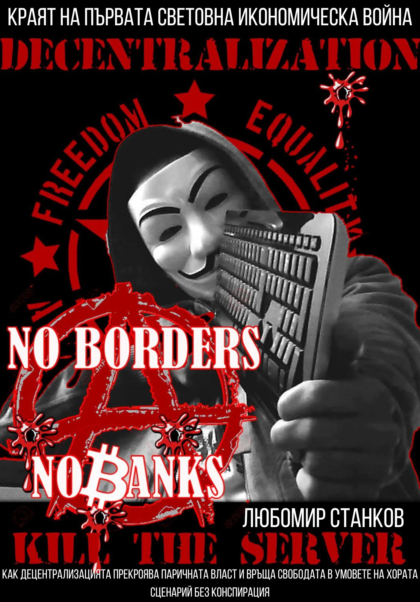

# Краят на първата световна икономическа война

Добре дошли в официалното GitHub репозитори на книгата **„Краят на първата световна икономическа война“** от Любомир Станков.

## За книгата

Това издание предлага нов поглед към икономическите, социалните и културните сблъсъци, белязали началото и края на Първата световна икономическа война. Книгата е написана с идеята да провокира размисъл и дискусия по темите за скритите сили зад световните икономически кризи, философските аспекти на властта, парите и човешката природа.

**Какво ще откриете вътре:**
- Анализи и факти за икономическите механизми и скрити процеси.
- Философски размишления върху човека, властта и парите.
- Въпроси, които ще ви накарат да преосмислите познатото.
- Богата историческа гледна точка, свързана с реални събития.

## Как да четете

Книгата е достъпна напълно безплатно в PDF формат!  
Можете да я изтеглите от [book.pdf](./book.pdf)

## Онлайн страница

Интерактивна и стилна представителна страница за книгата ще намерите на [index.html](./index.html).  
Можете да я разгледате и като GitHub Pages сайт (ако е активирано).

## Свържете се с автора

Ако имате въпроси, предложения или искате да споделите мнение за книгата, пишете на:  
**Любомир Станков** – [Stankov153@proton.me](mailto:Stankov153@proton.me)

## Лиценз

Това издание е предоставено за свободно четене и споделяне с некомерсиална цел.  
Моля, уважете труда на автора и посочвайте източника при цитиране.

---

_Благодарим ви, че подкрепяте свободното знание!_